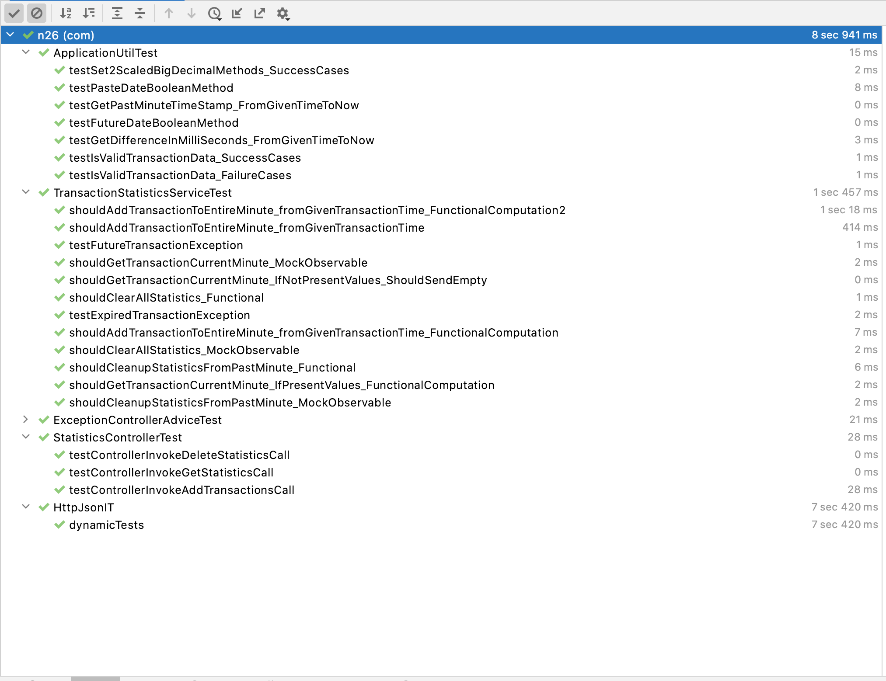

# Transaction Statistics REST API

This is a Java based REST application which intends in keeping track of statistics based on incoming transaction data within a time bound context of one minute.

The main purpose for this application is to keep track of realtime statistic for the given minute based on the transactions that are posted into the application.
This is a REST based application with three essentiel API endpoints:
1. One to post transactions to the sytem. It is also the sole input of this rest API.
2. One to get the current minute realtime statistic based of the transactions posted into the system.
3. One to delete all the transaction based statistics computed in the system

### Key Requirements imposed:
- You are free to choose any JVM language to complete the challenge in, but your application has to run in Maven.
- The API has to be threadsafe with concurrent requests.
- The `POST /transactions` and `GET /statistics` endpoints MUST execute in constant time and memory ie *O(1)*. Scheduled cleanup is not sufficient
- The solution has to work without a database (this also applies to in-memory databases).
- Unit tests are mandatory.
- `mvn clean install` and `mvn clean integration-test` must complete successfully.
- Please ensure that no changes are made to the `src/it` folder.
- In addition to passing the tests, the solution must be at a quality level that you would be comfortable enough to put in production.

### Key aspects related to implementation:
- Employing test driven development practice while building application - Each module goes through the `red` -> `fix` -> `green` -> `refactor` cycle
- Multithreaded development - System built should behave ideally for all concurrent multithreaded requests issued simultaneously by various actors.
   - Shared/Exclusive locks employed in the typical data access layer.
   - Re-entrant locks on reads/writes separately such that the system allows multiple threads to read(by acquiring read-lock) as long as no thread holds exclusive(write) lock.
   - Hence, the API calls are thread safe everywhere required.
- Intensive unit tests - Mocktio based unit tests to observe interactions of various actors
- Separation of concerns - Modular approach on top of MVC paradigm in giving specific responsibility to each modules in the application
  - *Service layer* to handle data persistence and business logics required to compute and clear the statistics information on the transaction data supplied
  - *Controller* to handle all the endpoint calls to process the data from users.
  - *Models* to keep track of data that is processed by the system.
  - *ControllerAdvice* to handle all the user defined exceptions handled at the runtime to send proper response code to users to better understand the flow.
- Dependency resolution with Spring-Boot's Auto-configuration and dependency resolution.
- Employing Inbuilt scheduling capabilities provided out-of-box by spring-boot framework.
   - Instead of cleaning up expired statistics, there is a scheduled task that works on finding all the Timestamp keys that are past current minute and removes them from the MapStore.
- Constant space/time complexity of O(C) ==> O(1) as long as the space remains constant for all N data processed.
    - approach : Concurrent Map based store which holds the computed statistics of the past one minutes -- total worst case space complexity 119 for a transaction with time T within current minute we will have 60 entries (current minute) + (T+59) entries there will be overlaps but worst case space complexity will be 119 Overall worst case complexity in Big-O ==> O(C) ==> O(1) where C=119 is a constant and doesn't change with count of transactions.
    - eg1: given a transaction at time T within the current minute where T = Now-1 second. here the txn is valid for the next 59 seconds.
    - eg2: add another transaction where time T = Now-59s. Here this transaction is only valid from Now hence all past seconds don't count.


## TDD - Red->Green->Refactor cycle


## REST APIs

#### Add a new transaction
##### Request
```http
POST /transactions HTTP/1.1
Host: localhost:8080
Content-Type: application/json

{
	"amount": 110,
	"timestamp": 1505252993000
}
```
### Request format:
*amount* – transaction amount; a string of arbitrary length that is parsable as a
BigDecimal

*timestamp* – transaction time in the ISO 8601 format YYYY-MM-DDThh:mm:ss.sssZ in the UTC timezone (this is not the current timestamp)

##### Response
Returns: Empty body with one of the following:

201 – in case of success

204 – if the transaction is older than 60 seconds

400 – if the JSON is invalid

422 – if any of the fields are not parsable or the transaction date is in the future


```http
HTTP/1.1 201 Created
Content-Type: application/json


```

#### Get current minute statistics
##### Request
```http
GET /statistics HTTP/1.1
Host: localhost:8080


```

##### Response
Returns: The computed statistics for all the posted transaction or empty if there are no transactions present.

```http
HTTP/1.1 200
Content-Type: application/json;charset=UTF-8

{
  "count":2,
  "sum":230.0,
  "avg":115.0,
  "min":110.0,
  "max":110.0
}
```


#### Clear all transactional data
##### Request
```http
DELTE /transactions HTTP/1.1
Host: localhost:8080


```

##### Response
Returns: No response body but 204 status.

```http
HTTP/1.1 204

```

### Test Coverage


## Testing
This application is build following TDD principles and are rich with various integration/unit tests based on test pyramids
To run all the tests:

```bash
mvn clean test
```

## Build
In order to build this application, run the following maven command.
```bash
mvn clean package
```
### installing the packages
With Tests:
```bash
$ mvn clean install -U
```
### running tests
Unit tests:
```bash
$ mvn  test
```
Integration tests:
```bash
$ mvn integration-test
```


>         Developed in Jetbrain's IntelliJ IDE

## 2019 Attempt: FAIL
*Some of the feedback given were:*
*PROS:*
- good test coverage
- good separation of concerns
*CONS:*
- did not meet the requirements (O(n) solution, does not clean up, not thread-safe everywhere)


## 2021 feedback: PASS
*Coding challenge feedback:*
* Unit test were added to `src/it` which is not allowed (as stated in problem statement) and that is why unit tests were missed in the first review.
* Using reflection in unit test to set fields is not the best practice. The object could have been injected as a dependency and be mocked later rather then setting them using reflection
* Usage of ConcurrentHashMap in conjunction with Reentrant lock is not really required since ConcurrentHashMap is thread safe out of the box. Also usage reentrant locks the whole HashMap for every read and write which is not an optimised solution.
* The solution is implemented correctly and is good enough for a Mid level.

## References
- https://codereview.stackexchange.com/questions/173545/rest-api-for-realtime-statistics-of-last-60-seconds
- https://softwareengineering.stackexchange.com/questions/356460/realtime-statistics-of-last-60-seconds-with-o1-time-and-memory
- https://stackoverflow.com/questions/63860391/stock-statistics-calculation-with-o1-time-and-space-complexity
- https://stackoverflow.com/questions/52200697/live-statistics-in-o1-space-and-time
- https://medium.com/@jerilkuruvila/simple-and-elegant-web-service-design-completely-decoupled-49d0901c5360
- https://rrgfthrt.blogspot.com/2018/11/rest-api-for-realtime-statistics-of.html
- https://stackoverflow.com/questions/559839/big-o-summary-for-java-collections-framework-implementations/559862#559862


## License

MIT
